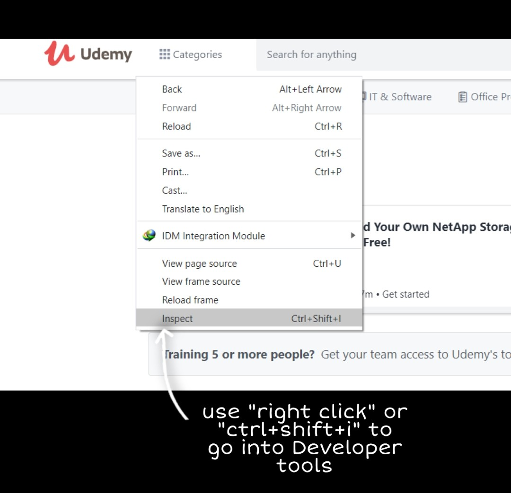
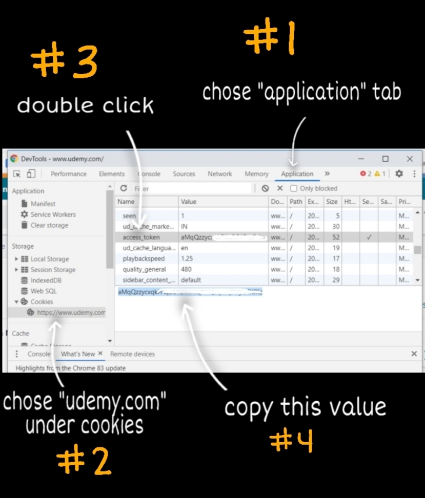
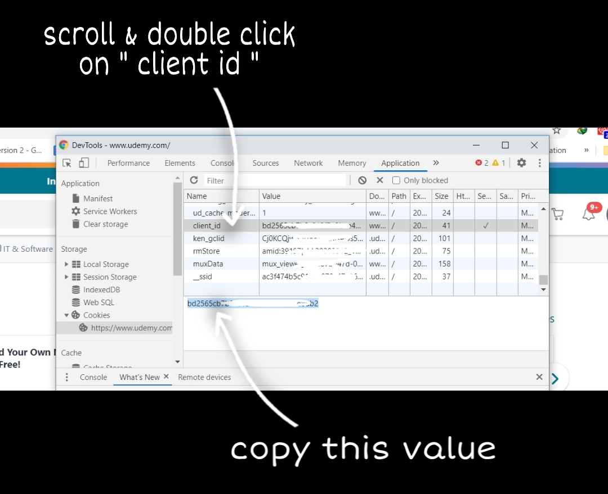
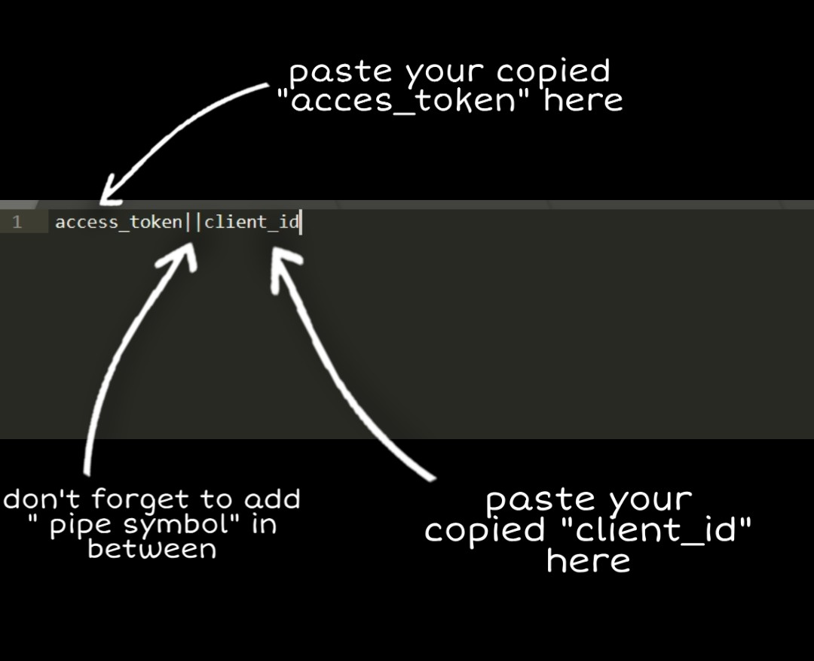
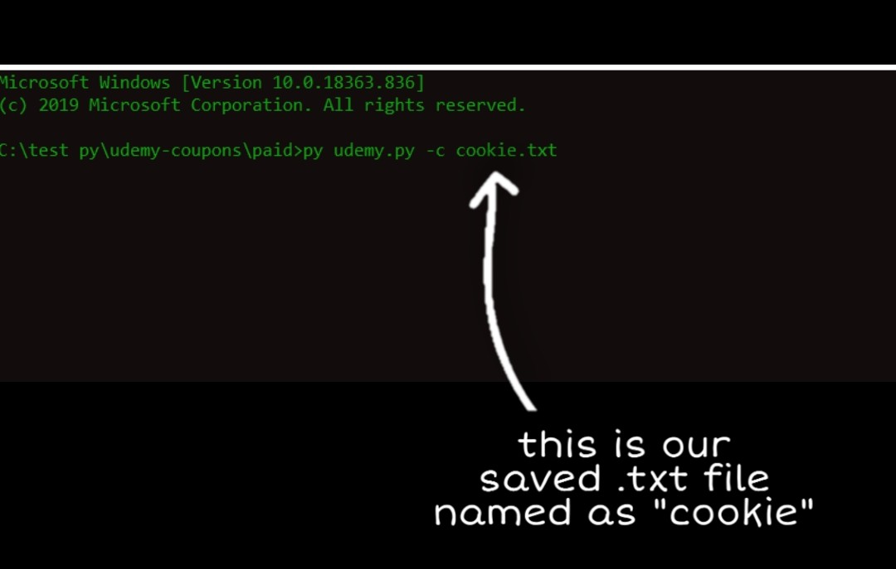

# Udemy-Course-Grabber
Script to add all udemy paid/free courses having coupons automatically to your udemy account

## ***Requirements***

- Python (2 or 3)
- Python `pip`
- Python module `requests`
- Python module `colorama`
- Python module `bs4`
- Python module `browser_cookie3`

## ***Module Installation***

	pip install -r requirements.txt

## ***Features***

- Automatic login through browser using `browser_cookie3`
- One click to add all courses available with coupons to your udemy account.
- You can add any specific course to your account from the list of courses available.
- Many popular sites added to grab fresh/new courses (coupons).
- Many more features

## ***Usage***

***Add all/specific course***

    python udemy.py

***Or with cookie***

    python udemy.py -c cookie.txt

***To schedule with cron jobs***

    python udemy.py --cron

***To subscribe only paid courses***

    python udemy.py --paid

***Guide to create cookie.txt file***
- Firstly go to udemy.com, then follow the images guide below

# Note: 
This script was originally made by https://github.com/AmmeySaini/Udemy-Paid-Courses-Grabber since there aren't any updates I decided to takeover.
